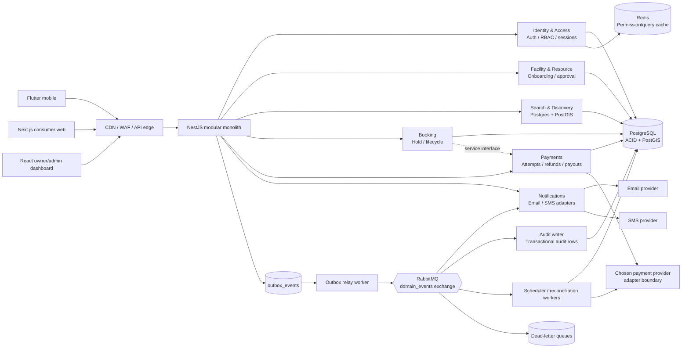
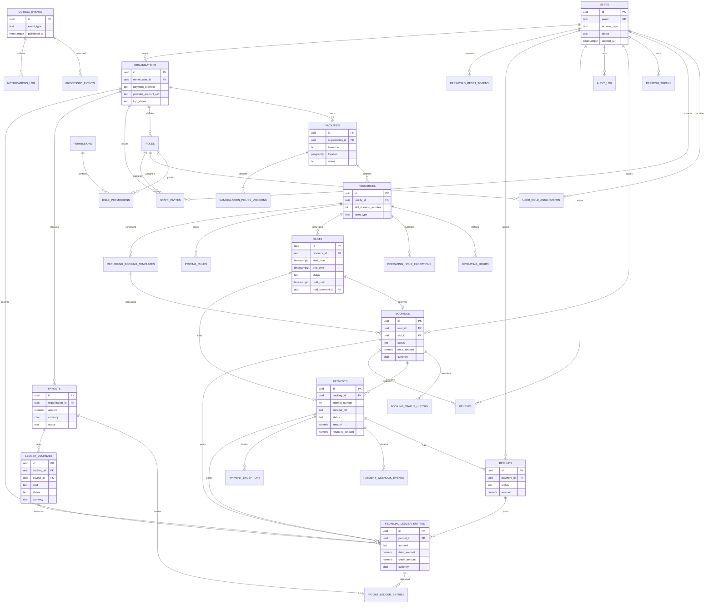

# Mermaid Diagrams

Diagrams reflect V1 module boundaries and schema decisions. They are documentation views, not migration definitions. Keep them aligned with `03-database-schema.md` and `06-architecture-modules.md`.

## Backend architecture

Rules:

- Booking correctness stays inside PostgreSQL transactions; RabbitMQ handles durable downstream events, not slot locking.
- Modules call exposed service interfaces or consume events. They do not access another module's tables directly.
- Payment provider choice remains an adapter decision outside the core booking model.
- Every RabbitMQ consumer is idempotent and has a dead-letter queue. Payment, slot-expiry, and outbox workers are retryable.

## Database relationships

`SLOTS ||--o| BOOKINGS` describes the active-booking partial unique index. Cancelled and expired booking history may contain multiple rows for one slot over time.
